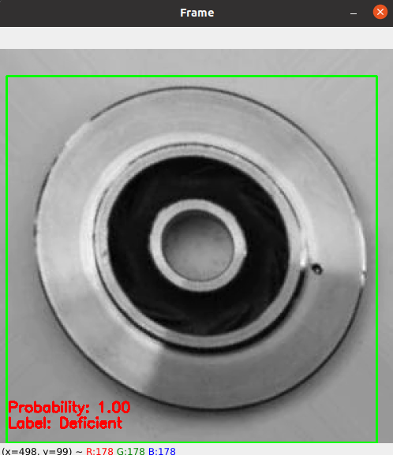

# Quality control on production lines with Computer Vision and TinyML

This repository includes a jupyter notebook that presents a complete pipeline for:

- EDA on image data
- Data preparation and augmentation
- Deep learning (CNN) models development for image classification with TensorFlow
- Models evaluation 
- Model interpretation predictions with LIME
- Transformation to TFLite format to allow their usage in embedded devices
- Post-training quantization
- Quantization aware training
- Overall evaluation

Complete explanations of the above are available in the notebook which is also available in PDF format.

Moreover, there is a python script `opencv_object_tracking.py` that allows the real-time usage of the developed models

## Instructions

1) `git clone <repo>`
2) If you want to run the `jupyter notebbok` download the dataset from Kaggle: https://www.kaggle.com/datasets/ravirajsinh45/real-life-industrial-dataset-of-casting-product.
3) Unzip and Copy the data folder into the repository. The folder should be named `casting_data` and include the `test` and `train` folders.
4) Install the imported libraries in a new python virtual environment to avoid dependencies errors.
5) Note that running the notebook as it is, will override the saved models in the `saved_models` folder.

The trained TFLite models can be used in practice to embedded devices based on Linux, such as Raspberry Pi and Coral devices with Edge TPU, among many others with the following steps:
1) `pip install requirements.txt` 
2) For local testing the repo includes the `casting_test.mp4` video that was created from the test images of the dataset with 1 FPS. To check a TFLite model on that video run in the terminal : `python opencv_object_tracking.py --video casting_test.mp4`. You can specify the model that will be used for inference with the `--model` flag (The model should be stored inside the `saved_models` folder). 
For example `python opencv_object_tracking.py --video casting_test.mp4 --model cnn_model.tflite`
3) When the video opens, press `s` to select the area of the frame that will be the input of the image classifier. This process is required only at the beginning to calibrate the tracker. Output: 
4) This script can be also used for image classification with input from a connected camera with the command:` python opencv_object_tracking.py`

### This repository was developed in the scope of H2020 AI REGIO project. 
AI REGIO is a project funded by the European Union Framework Programme for Research and Innovation Horizon 2020 under Grant Agreement n° 952003.
